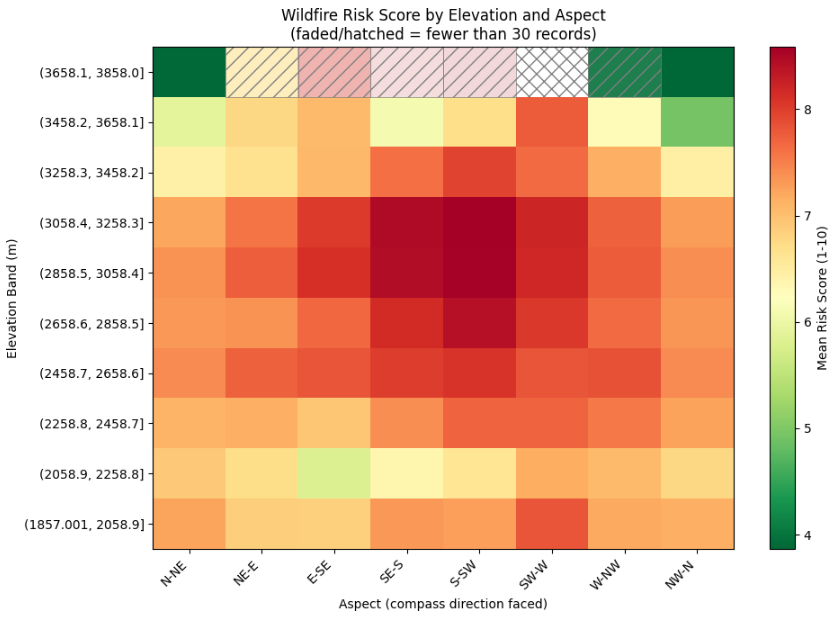
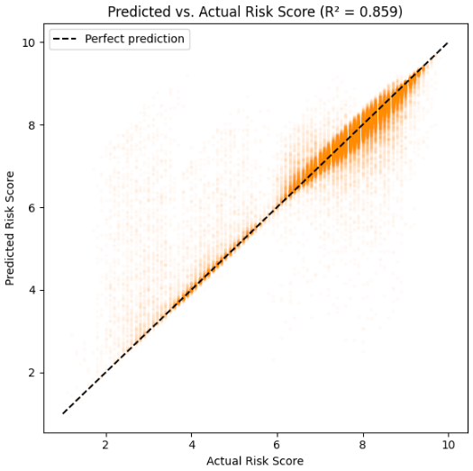
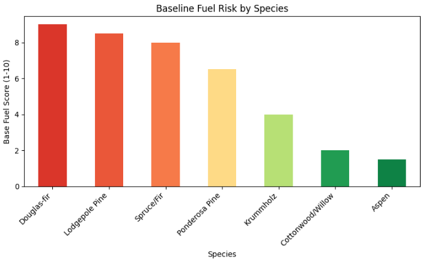
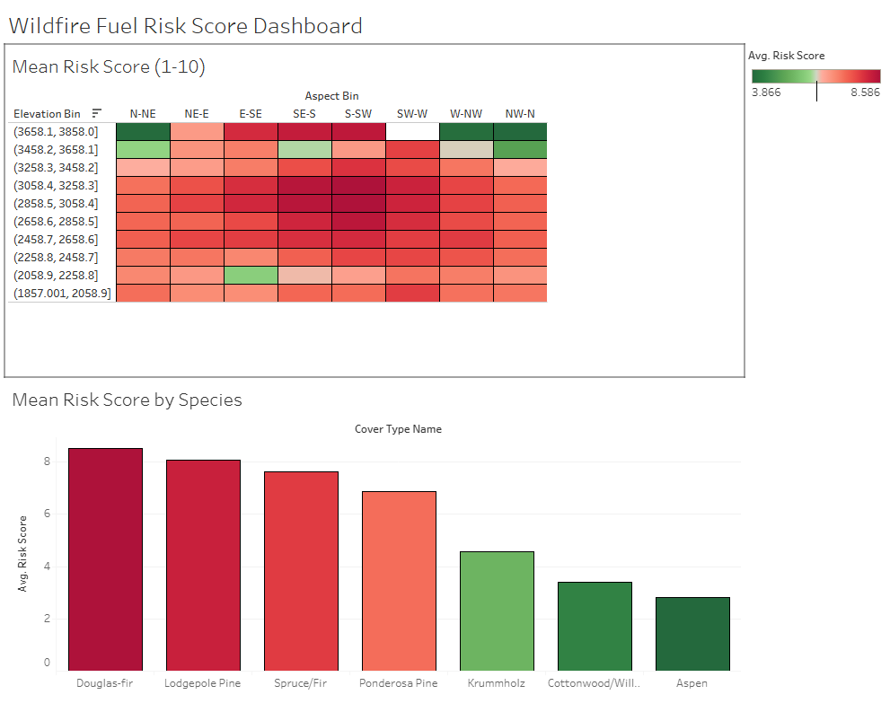

# Wildfire Fuel Risk Scoring

A quantitative risk-scoring prototype that combines domain-informed fire-ecology knowledge with terrain data to estimate wildfire fuel risk, built as an independent project using the `sklearn` `covtype` dataset (Roosevelt National Forest, CO).

Each forest record is assigned a continuous 1–10 risk score based on species fuel characteristics and terrain factors known to affect fire behavior, such as slope, solar exposure, and proximity to historical fire activity. A Random Forest regression model is then trained to estimate that score from terrain and soil data alone, without knowing the species present, achieving an R² of 0.86. The project also includes residual diagnostics, a confidence-aware geographic risk map, and a business-facing writeup connecting the model to real decision-making, specifically wildfire risk assessment for land development and site selection.

## Highlights

- Engineered a composite risk score from domain knowledge (species fuel characteristics) and terrain data (slope, solar exposure, fire-history proximity)
- Trained and validated a Random Forest regression model, catching and correcting a feature-leakage bug along the way
- Ran a residual analysis to identify where and why the model's predictions are less reliable
- Built a confidence-aware heatmap that visually flags low-sample-size regions instead of presenting every estimate with equal confidence
- Translated the analysis into a business use case: comparing land-development sites by wildfire exposure and estimating expected mitigation needs

## Risk by Elevation and Aspect

Risk peaks at mid-elevation on south and southwest-facing terrain, consistent with known fire-ecology patterns. Cell opacity and hatching indicate sample size, so sparsely-sampled cells (like the highest elevation band) are visually flagged as lower-confidence rather than shown with the same weight as well-populated ones.

## Model Validation

A Random Forest regressor estimates the risk score using only terrain and soil features, no species information, achieving an R² of 0.86 on held-out data.

## Baseline Fuel Risk by Species

## Interactive Dashboard

An interactive Tableau version of the risk heatmap and species comparison, with click-to-filter interactivity between the two views:

**[View the live dashboard on Tableau Public](https://public.tableau.com/app/profile/richard.newfield/viz/Wildfire-Fuel-Risk-Dashboard/WildfireFuelRisk)**

## Contents

| File | Description |
|---|---|
| [`Wildfire_Risk.ipynb`](Wildfire_Risk.ipynb) | Full analysis notebook: data prep, risk score construction, model training, validation, residual analysis, and geographic visualization |
| [`Wildfire_Risk_Report.pdf`](Wildfire_Risk_Report.pdf) | Business-facing writeup of methodology, findings, and the land-development use case |

## Tech Stack

Python, pandas, scikit-learn (Random Forest), matplotlib, Tableau

## Author

Richard Newfield III
[GitHub](https://github.com/runewfield3) | [runewfield3@gmail.com](mailto:runewfield3@gmail.com)